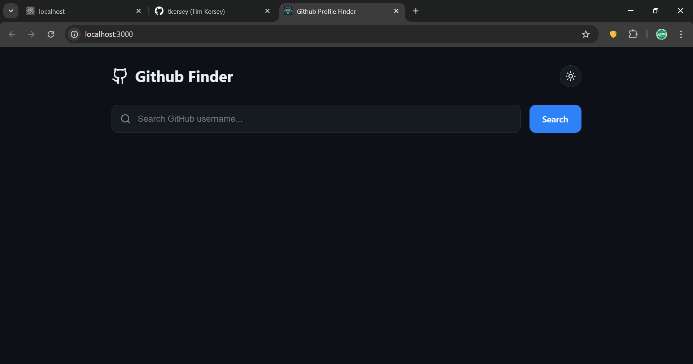
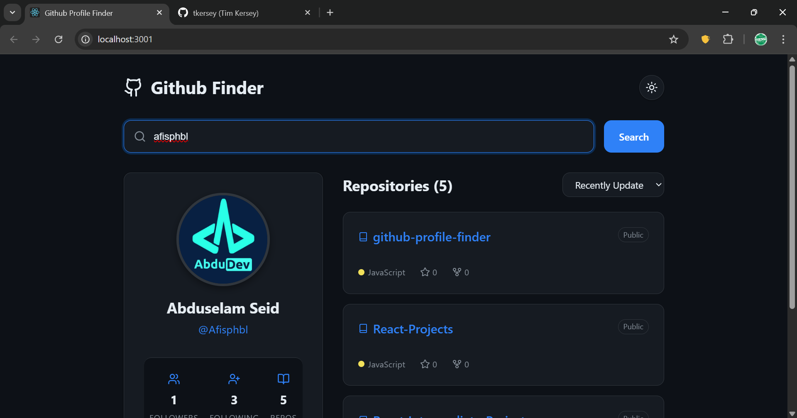
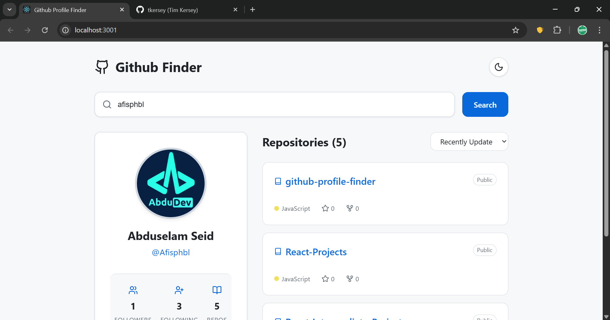
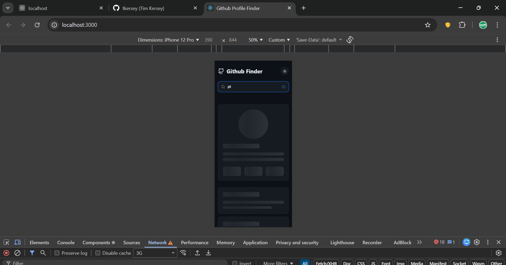
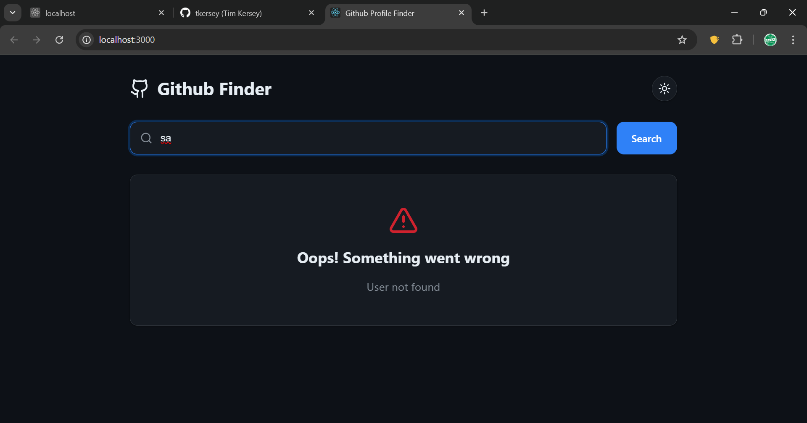

# 🚀 GitHub User Explorer

A modern and responsive GitHub User Search App built with React, featuring real-time search, debouncing, dark/light theme toggle, skeleton loaders, and GitHub API integration.

## ✨ Features

- 🔍 Real-time GitHub user search with debounce optimization

- 🌓 Light / Dark theme toggle (persistent using localStorage)

- ⚡ Fast & responsive UI with skeleton loading animations

- 📦 Repository listing with sorting options

- 👥 Followers preview with Load More pagination

- 🛠 Context API for global state management

- 🎨 Modern, clean UI design

- ❌ Graceful error handling

## 🖼️ Preview

Example:



### 🌙 Dark Mode



### ☀️ Light Mode



### ⏳ Loading



### 🚫 Error Handle



### 📱 Mobile View


## 🧱 Tech Stack

- React 18

- Context API

- GitHub REST API

- Lucide Icons

- CSS3 (Modern UI + Animations)

## 📂 Project Structure

````text
src/
│
├── components/
│   ├── Button.jsx
│   ├── ErrorMessage.jsx
│   ├── FollowerList.jsx
│   ├── ProfileCard.jsx
│   ├── RepoList.jsx
│   ├── SearchBar.jsx
│   └── SkeletonLoader.jsx
│
├── context/
│   ├── GithubUser.jsx
│   └── ThemeContext.jsx
│
├── hooks/
│   └── useDebounce.js
│
├── styles/
│   └── *.css
│
├── App.jsx
└── main.jsx

## ⚙️ Installation & Setup

### 1️⃣ Clone the repository
```bash
git clone https://github.com/your-username/github-user-explorer.git
````

### 2️⃣ Install dependencies

```bash
npm install
```

### 3️⃣ Start development server

```bash
npm start
```

Open in browser:

```bash
http://localhost:3000
```

## 🧠 Core Concepts Used

- React Context API – global state management

- Custom Hooks – debouncing logic

- Conditional Rendering – loaders & error handling

- Theme System – CSS variables + localStorage

- Reusable Components

## 🛠 Key Functionalities Explained

🔹 Debounced Search

Prevents unnecessary API calls while typing.

🔹 Theme Persistence

User theme is saved in localStorage.

🔹 Skeleton Loading UI

Improves perceived performance.

🔹 Repository Sorting

Sort repos by:

- Recently updated

- Most starred

## 🌍 API Reference

GitHub REST API

```bash
https://api.github.com/users/{username}
https://api.github.com/users/{username}/repos
https://api.github.com/users/{username}/followers
```

## 🧪 Example Usage

```bash
Search → "afisphbl"
```

## 🚀 Future Improvements

- 🔐 Authentication with GitHub OAuth

- 📊 Repo analytics charts

- 💾 Favorite profiles

- 🌎 Multi-language support

## 🌍 Live Demo

🔗 **Visit the App:** https://your-live-link-here

## 👨‍💻 Author

Abduselam Seid aka (Afis)
Frontend Developer — React • JS • UI/UX

🔗 GitHub: https://github.com/afisphbl

## ⭐ Support

If you like this project:

```bash
Give it a ⭐ on GitHub!
```
